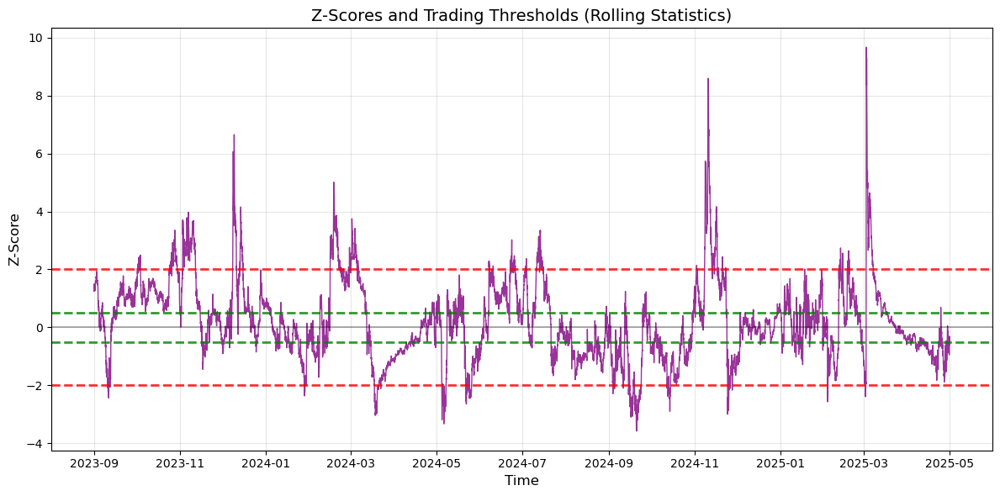

# QR_Presentations
Repository of reports and notebooks of my quantitative research work. Includes market microstructure alpha research, factor modeling, arbitrage. None of the information in this repository constitutes professional financial advice.


## Structure
```
QR_Presentations/
├── README.md
├── requirements.txt
├── AlphaResearch/
│   └── OBPressure.ipynb 
│         ...
├── Arbitrage/ 
│   └── Statarb.ipynb 
│   └── PCAarb.ipynb 
│         ... 
```

Many of the reports in this repository are based on implementing various research papers, all of which are linked below. 

## Papers

- https://papers.ssrn.com/sol3/papers.cfm?abstract_id=3235890 
- https://papers.ssrn.com/sol3/papers.cfm?abstract_id=1153505 
- https://papers.ssrn.com/sol3/papers.cfm?abstract_id=4739373
- https://people.orie.cornell.edu/sfs33/LimitOrderBook.pdf

## Areas of Interest 

### Statistical Arbitrage 

Statistical arbitrage (stat arb) is a quantitative trading strategy that exploits mean-reverting relationships between securities by modeling their price dynamics through statistical methods. It typically involves identifying cointegrated asset pairs or constructing market-neutral portfolios whose deviations from historical equilibrium levels can be modeled and traded. Traders capitalize on short-term mispricings by entering long/short positions and exiting once the spread reverts, often under the assumption of a stationary residual process such as an Ornstein-Uhlenbeck model. Execution requires rigorous backtesting, risk management, and frequent rebalancing to adapt to evolving market regimes.

PCA is very relevant to this area of trading. The top components often align with intuitive factors (e.g., market beta, sector risk), while lower-ranked ones can reveal idiosyncratic or mean-reverting behaviors. In trading, these "eigenportfolios" serve as bases for constructing statistical arbitrage strategies, risk premia decomposition, or noise filtering, enabling factor-driven portfolio design and alpha isolation.



### Cross-Exchange Arbitrage 

Cross-exchange arbitrage leverages price discrepancies for the same asset across multiple trading venues, aiming to buy low on one exchange and simultaneously sell high on another. When targeting sub-second opportunities, latency becomes the critical constraint—strategies must account for network delays, order placement speeds, and slippage. Profitability hinges on minimizing round-trip execution time relative to the price convergence window, often necessitating colocated servers, low-latency infrastructure, and predictive models to front-run temporary divergences before they close. Evaluating trade viability under latency constraints involves modeling expected spreads net of fees, execution lag, and adverse selection.

### Alpha-Research and Machine Learning

Alpha research on market microstructure focuses on designing predictive signals using high-frequency order book data, trade flow characteristics, and limit order dynamics. Key elements include order imbalance, quote stiffness, spread dynamics, and queue positioning—each offering insights into short-term supply-demand imbalances. The objective is to engineer interpretable, statistically robust features that demonstrate persistence and predictive power over sub-minute horizons. Successful microstructure alphas typically combine real-time signal processing with rigorous empirical validation (e.g., information coefficient, Sharpe ratio), and must account for market impact, execution constraints, and sampling biases.

Machine learning in high-frequency trading is increasingly employed to forecast sub-minute price movements by learning nonlinear patterns from rich feature spaces derived from tick data, order book snapshots, and engineered microstructure signals. Models such as gradient boosting, LSTMs, or temporal convolutional networks are trained to classify directional movement, estimate expected returns, or predict regime switches. The key challenge lies in signal degradation due to market noise and overfitting, requiring careful feature selection, walk-forward validation, and latency-aware deployment. Often in HFT, linear-regression is preferred over more complex non-linear appraoches simply due to the computational efficiency (only needing to compute a dot-product). Thus, a robust understanding of the fundamentals is often more valuable than jumping on the latest trends in the AI/ML space.
